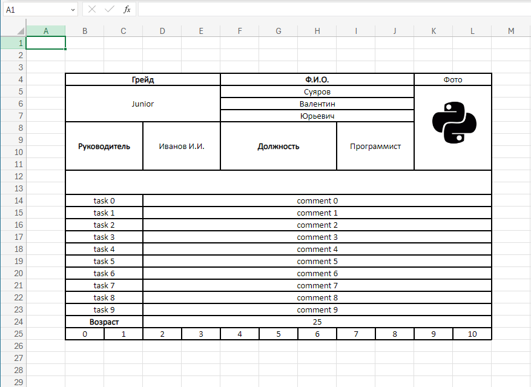
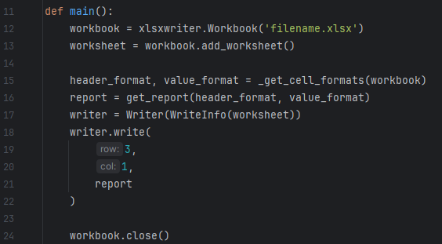
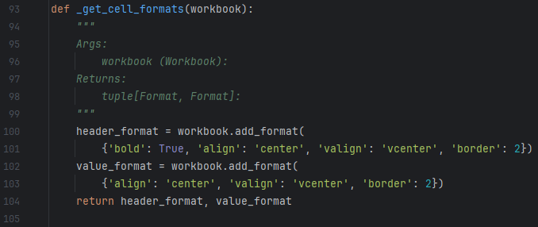
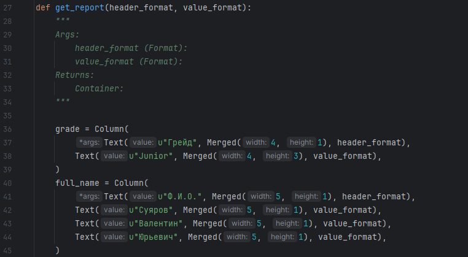
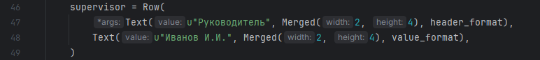
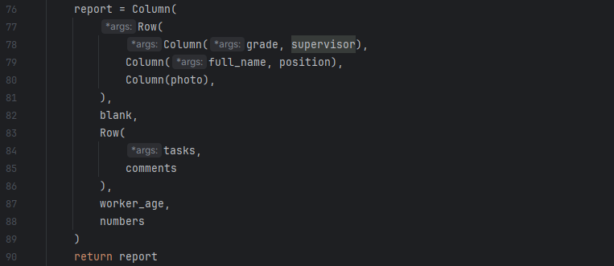
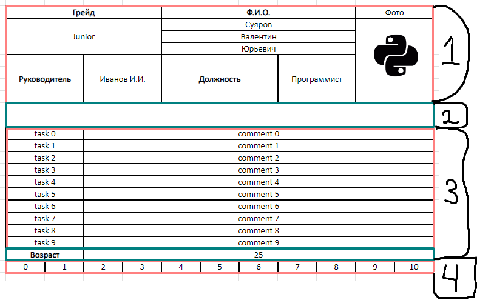
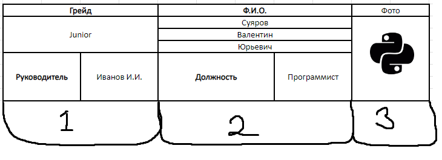

<h2>Содержание:</h2>
<ul>
 <li>1. Мотивация</li>
 <li>2. В чем идея</li>
 <li>3. Разбор примера</li>
</ul>

<h2>1. Мотивация</h2>

Задача написать отчет эксель, наверное, самая частая у нас в команде.
 Для написания отчета обычно мы используем xlsxwriter и csv.
 Если с csv логика формирования отчета довольно проста, 
то с xlsxwriter можно строить довольно сложные отчеты и логика формирования отчета
в таком случае может быть довольно большой и запутанной и что более важно, 
для каждого существующего скрипта логика формирования отчета скорее всего будет разная.
 Данная библиотека по задумке может использоваться, как ресурс для скриптов, 
это позволит привести логику формирования отчетов к единому формату.

<h2>2. В чем идея</h2>

Основная идея в том, чтобы избавиться от явной записи каждой ячейки.
Это достигается тем, что отчет строится на основе контейнеров.
Контейнер можно воспринимать, как абстрактный объект, который знает,
какие объекты он хранит и какие у них размеры (мерж размеры). Контейнер может хранить,
как другие контейнеры, так и ячейки.
Контейнеры бывают двух видов, Row и Column.
Row означает, что все элементы этого контейнера, расположены горизонтально.
Соответственно в Column все элементы расположены вертикально.
 Так как контейнеры могут содержать другие контейнеры, это позволяет формировать
сетку любого вида. В последствии на основе этой сетки и записывается отчет в эксель.

<h2>3. Разбор примера</h2>

 В примере (в файле main.py), показан способ создания <b>xlsx</b> отчета.
 Перед тем, как перейти к коду посмотрим на итоговый отчет, 
который генерирует скрипт. Сейчас нам интересно только на него посмотреть, а пригодится
он позже.

 Весь код примера содержится в функции <b>main</b>.
 В самом начале создаются <b>workbook</b> и <b>worksheet</b>, для работы с xlsx.

 Далее метод <b>_get_cell_formats</b> определяет форматы для заголовков и значений 

 Полученные форматы передаются в ключевую функцию всего примера - <b>get_report</b>,
который и создает отчет, который видели выше.

 Начнем с нескольких первых строк.

Здесь создаются объекты <b>grade</b> и <b>full_name</b> типа <b>Column</b>.
Это значит, что все элементы, которые содержат эти объекты буду расположены вертикально.
Мы также можем увидеть, как выглядят эти объекты в самом отчете.

В данном примере наши объекты содержат только объекты типа <b>Text</b>.
 В <b>Text</b> передается значение, которое будет содержать ячейка, 
также передается объект <b>Merged</b>, который определяет, стоит ли объединять ячейки 
и как объединять, ну и последним аргументом передается формат ячейки типа <b>Format</b>.
 Для примера посмотрим еще на объект типа <b>Row</b>.

Далее создается еще несколько контейнеров и в конечном счете формируется "сетка" отчета.

Что собственно здесь происходит, на самом деле отчет является типом <b>Column</b>, 
значит все элементы в нем расположены вертикально, 
и сопоставив код и отчет мы можем явно увидеть эти элементы.

Далее можно углубиться на второй уровень вложенности, насмотрим элемент под номером 1.
Он по своей сути является объектом <b>Row</b>. В нем прослеживаются следующие элементы.

В итоге углублять можно до тех пор, пока не дойдем до конкретной ячейки. 
Таким образом комбинируя <b>Row</b> и <b>Column</b> можно добиться любой сетки.

В конце концов <b>get_report</b> возвращает контейнер (сетку), который далее передается 
во <b>writer.write</b>, в итоге в этом методе врайтер проитерируется 
по всем ячейкам контейнера и запишет их в эксель.

